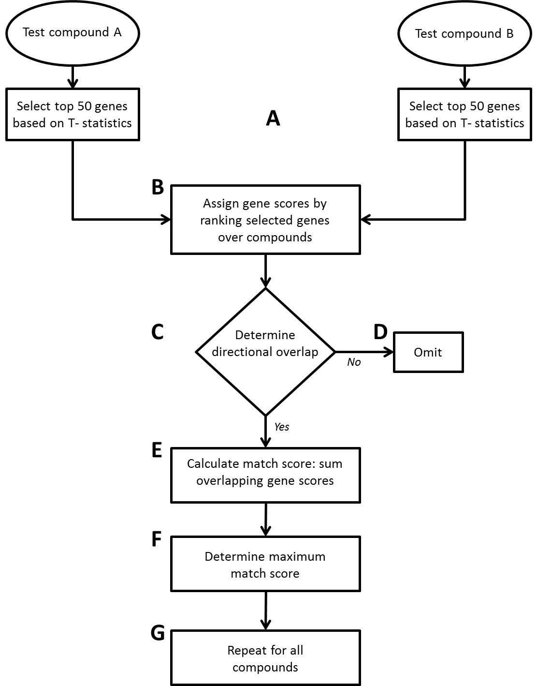

# comparison approach

## Description
The comparison approach is a toxicogenomics tool to match compounds based on their modes of action. This github repository is a tutorial of the comparison approach as used in Heusinkveld et. al. 2018 and Luijten et. al. 2019 In brief, the comparison approach selects per compound the top 'n' (n=50 by default) most regulated genes based on their absolute T-statistics, and assigns subsequently a linear descending score to the highest ranked genes over the compared compounds. If the genes are regulated in the same direction, the scores of these genes are summed, which result in a "match score" between compounds.

## Flowdiagram of the comparison approach



## Setup
#### Command line:   
```
git clone  https://github.com/wackerspaul/comparison-approach.git
```

#### R-studio:
File -> new project -> version control -> git   
Repository URL:   
https://github.com/wackerspaul/comparison-approach


## Input
The comparison approach requires the following files as input:

* Per compound a T-statistic file  
  * First column should be the gene identifiers  
  * Following colum(s) the T-statistics of the compound (per concentration or time point)
    &nbsp;
  
    | geneID | Compound_A_Low | Compound_A_Mid | Compound_A_High |
    |:------:|:--------------:|:--------------:|:---------------:|
    | Gene_1 | -1.02          | -1.50          | -1.20           |
    | Gene_2 | 1.28           | 2.05           | 3.10            |
    | Gene_3 | 4.25           | 5.10           | 4.60            |
    | etc.   | etc.           | etc.           | etc.            |

  
  &nbsp;
  
* A gene annotation file  
  * Information about the genes in the analysis. The gene annotation file should contain a column matching the gene identifiers in the T-statistic files.
    &nbsp;
  
    | geneID | GeneSymbol   | GeneName   | Pathway   |
    |:------:|:------------:|:----------:|:---------:|
    | Gene_1 | GeneSymbol_1 | GeneName_1 | Pathway_1 |
    | Gene_2 | GeneSymbol_2 | GeneName_2 | Pathway_1 |
    | Gene_3 | GeneSymbol_3 | GeneName_3 | Pathway_2 |
    | etc.   | etc.         | etc.       | etc.      |
  
   *Note the column geneID of the gene annotation file matching the column geneID in the T-statistics file*
  
  &nbsp;
  
## Output
The comparison approach has the following tables as output:
  * A master table, an all versus all table where each compound per concentration/timepoint/.. is compared to all the other compounds concentration/timepoint.. : 
  
    &nbsp;
  
    |               | Compound_A_Low | Compound_A_Mid | Compound_A_High | Compound_B_Low | Compound_B_Mid | Compound_B_High | Compound_C_Low | Compound_C_Mid | Compound_C_High |             
    |:-------------:|:--------------:|:--------------:|:---------------:|:--------------:|:--------------:|:---------------:|:--------------:|:--------------:|:---------------:|
    Compound_A_Low  | NA             | NA             | NA              | 0              | 0              | 0               | 0              | 0              | 0               | 
    Compound_A_Mid  | NA             | NA             | NA              | 0              | 0              | 0               | 0              | 27             | 0               | 
    Compound_A_High | NA             | NA             | NA              | 0              | 43             | 47              | 0              | 0              | 2               | 
    Compound_B_Low  | 0              | 0              | 0               | NA             | NA             | NA              | 436            | 518            | 395             | 
    Compound_B_Mid  | 0              | 0              | 43              | NA             | NA             | NA              | 313            | 995            | 929             | 
    Compound_B_High | 0              | 0              | 47              | NA             | NA             | NA              | 317            | 890            | 949             | 
    Compound_C_Low  | 0              | 0              | 0               | 436            | 313            | 317             | NA             | NA             | NA              | 
    Compound_C_Mid  | 0              | 27             | 0               | 518            | 995            | 890             | NA             | NA             | NA              | 
    Compound_C_High | 0              | 0              | 2               | 395            | 929            | 949             | NA             | NA             | NA              | 

  &nbsp;
  
  * A best match table, for each compound comparison the best match is selected over the concentrations/timepoints:
  
    |            | Compound_A | Compound_B | Compound_C |
    |:----------:|:----------:|:----------:|:----------:|
    | Compound_A | NA         | 47         | 27         |
    | Compound_B | 47         | NA         | 995        |
    | Compound_C | 27         | 995        | NA         |

  &nbsp;
  
  
  * An ordered best match table: 

    | Compound_A     | Compound_B      | Compound_C      |
    |:--------------:|:---------------:|:---------------:|
    | Compound_B: 47 | Compound_C: 995 | Compound_B: 995 |
    | Compound_C: 27 | Compound_A: 47  | Compound_A: 27  |
    | Compound_A: NA | Compound_B: NA  | Compound_C: NA  |

  &nbsp;

  * A detailed list of the best matches:
  
    | Comparison            | MatchName                       | Score | TstatisticScore | NumberOfHits |
    |:---------------------:|:-------------------------------:|:-----:|:---------------:|:------------:|
    | Compound_B-Compound_C | Compound_B_Mid-Compound_C_Mid   | 995   | 765             | 26           |
    | Compound_A-Compound_B | Compound_A_High-Compound_B_High | 47    | 29              | 1            |
    | Compound_A-Compound_C | Compound_A_Mid-Compound_C_Mid   | 27    | 17              | 1            |

  &nbsp;

  * A genelist of the hits:
  
    | geneID | GeneSymbol   | GeneName   | Pathway   | score.over.compounds | score.tstat | regulation |
    |:------:|:------------:|:----------:|:---------:|:--------------------:|:-----------:|:----------:|
    | Gene_1 | GeneSymbol_1 | GeneName_1 | Pathway_1 | 9                    | 14.63373    |  -         |
    | Gene_2 | GeneSymbol_2 | GeneName_2 | Pathway_1 | 94                   | 38.62147    |  +         |
    | Gene_3 | GeneSymbol_3 | GeneName_3 | Pathway_2 | 86                   | 37.48938    |  +         |
    | Gene_4 | GeneSymbol_4 | GeneName_4 | Pathway_3 | 82                   | 29.59908    |  +         |
    | Gene_5 | GeneSymbol_5 | GeneName_5 | Pathway_1 | 46                   | 28.75784    |  +         |
    | etc    | etc          | etc        | etc       | etc                  | etc         | etc        |
    | etc    | etc          | etc        | etc       | etc                  | etc         | etc        |

 &nbsp;

## Run the analysis

``` R
# Clean session
rm(list=ls())
graphics.off()
options(stringsAsFactors = FALSE)

# Set work-directory
setwd("/path/to/working/directory/")

# Load functions
source("./script/functions.R")
ls() # you should now see 10 functions (indicated by .fun in the name)

# Read the gene-annotation file
Annotation <- read.delim("./info/GeneAnnotation.txt")

# Read the T-statistic data using the function read.data.fun()
# directory is the path to the directory where the T-statistics files per compound are located
# NB. T-statistics data should be tab-delimited
tstatdata <- read.data.fun(directory = "./data/")

# Make sure the gene order is consistent in the gene annotation and T-statistic files
all(rownames(tstatdata$Compound_A) == rownames(tstatdata$Compound_B)) # [1] TRUE
all(Annotation$geneID == rownames(tstatdata$Compound_B)) # [1] TRUE

# Use the function run.analysis.fun() to the analysis
# tstats is the object containing the T-statistics of the compounds (object returned from read.data.fun())
# n is number of top genes in the analysis
# annotation is the gene annotation file
# geneid is the column name in the annotation file to match the annotation file with the rownames of the T-statistics
analysis.result <- run.analysis.fun(tstats=tstatdata, 
                                    n=50, 
                                    annotation=Annotation, 
                                    geneid="geneID")

# To extract a result table, use the function getResult.fun()
# analysis.object is object returned from run.analysis.fun()
# table is the result table to extract (options: "Master", "BestMatch", "BestMatchOrdered")
# metric is the scoring metric to extract (options: "Score", "TstatScore", "NumberOfHits", "All")
result.table <- getResult.fun(analysis.object = analysis.result, 
                              table = "BestMatchOrdered", 
                              metric = "All")
View(result.table)

# To extract a genelist for a specific match, use the function getGenes.fun()
# analysis.object is object returned from run.analysis.fun()
# match.name is the name the match to extract (i.e. the match names in the column "MatchName" from the table BestMatchOrdered and metric All)
genelist <- getGenes.fun(analysis.object = analysis.result, 
                         match.name = "Compound_B_Mid-Compound_C_Mid")
View(genelist)

```


